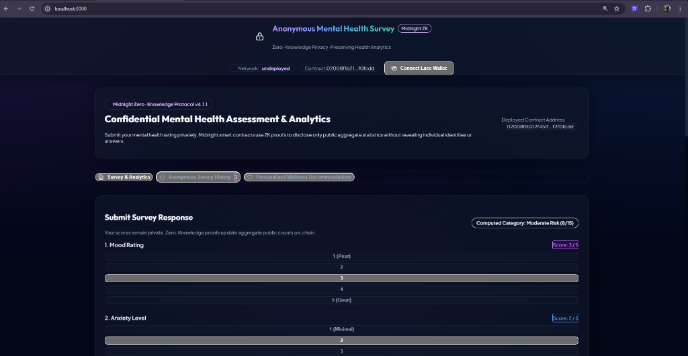
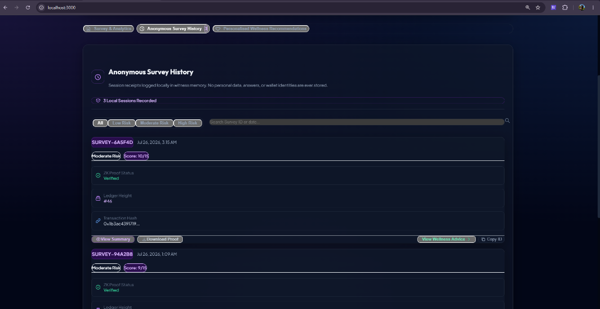
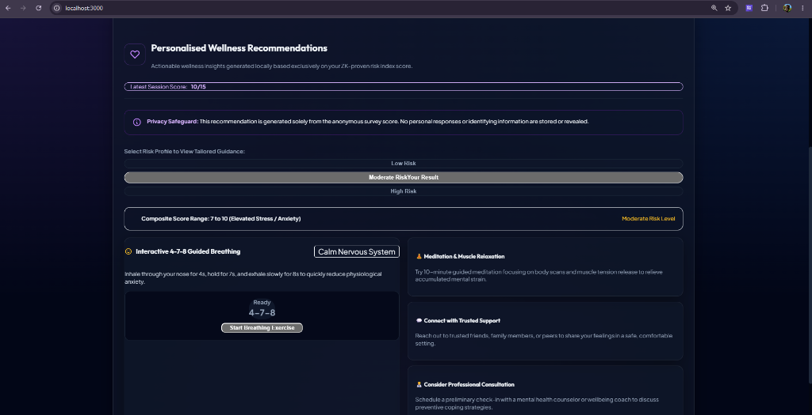

# Anonymous Mental Health Survey

> **Midnight Protocol Application** | Zero-Knowledge Privacy-Preserving Health Analytics & Feedback Platform  
> Built with Compact Smart Contracts + Midnight JS SDK + React + TypeScript + Glassmorphism Design System

[](https://midnight.network)
[](https://github.com/midnightntwrk/compact)
[](LICENSE)
[](https://github.com/Suchismita40/anonymous-mental-health-survey/actions)

---

# Project Overview

**Anonymous Mental Health Survey** is a full-stack, Zero-Knowledge privacy-preserving healthcare analytics application built on the **Midnight Network**.

It allows individuals to submit confidential mental health assessments (Mood, Anxiety, and Stress scores rated 1–5) with complete privacy guarantees. Using Midnight's Compact smart contract toolchain, individual score entries remain encrypted inside local client witness state. Zero-Knowledge proofs are generated client-side to assert score validity (1..5) and update public aggregate statistics on-chain—without disclosing participant identity, wallet address, or individual answers.

---

# Application Preview

## Landing Page

<p align="center">
  
</p>

The landing dashboard introduces the Anonymous Mental Health Survey platform built on Midnight Protocol. It provides a privacy-first environment where users can confidentially submit mental health assessments while Zero-Knowledge Proofs ensure that only anonymous aggregate insights are published without revealing individual responses.

---

## Survey History

<p align="center">
  
</p>

The Anonymous Survey History dashboard securely displays previous anonymous survey sessions using privacy-preserving identifiers. Users can review risk summaries, Zero-Knowledge verification status, ledger confirmations, and downloadable proof receipts without exposing any personal information or survey responses.

---

## Personalised Wellness Recommendations

<p align="center">
  
</p>

The Personalised Wellness Recommendations page generates tailored wellbeing guidance based solely on the anonymous risk category calculated from the survey. Recommendations are produced locally without storing or revealing personal responses, demonstrating confidential healthcare analytics powered by Midnight Protocol.

---

# 🎥 Live Demo

Watch the complete demonstration of the Anonymous Mental Health Survey platform powered by Midnight Protocol. The demonstration showcases confidential survey submission, Zero-Knowledge proof generation, anonymous survey history, personalised wellness recommendations, and privacy-preserving healthcare analytics.

▶ **[Watch the complete project demonstration on YouTube](https://youtu.be/BSLeDq4-OzA)**

---

## Problem Statement

Mental health surveys conducted in corporate, academic, and medical environments suffer from severe underreporting and low participation due to fundamental privacy concerns:

1. **Identity Exposure Risk**: Participants fear that private rating scores could be traced to their IP addresses, wallet keys, or user accounts.
2. **Data Centralization Vulnerabilities**: Centralized databases containing mental health records present lucrative targets for data breaches and unauthorized access.
3. **Lack of Verifiable Anonymity**: Traditional web forms claim anonymity but maintain server logs and database records capable of deanonymizing participants.

---

## Solution Overview

The **Anonymous Mental Health Survey dApp** addresses these privacy challenges using Midnight Protocol's Zero-Knowledge technology:

- 🔒 **Local Witness Execution**: All private rating choices remain strictly inside local browser memory.
- ⚡ **Zero-Knowledge Circuit Proofs**: Compact circuits execute locally, generating cryptographic ZK proofs that verify scores fall within valid bounds (1 to 5) and fall into designated risk categories—without disclosing exact rating values.
- 📊 **Verifiable On-Chain Aggregates**: The public blockchain ledger updates cumulative score totals and risk category counters (+1), serving transparent public analytics while preserving participant anonymity.

---

## Key Features

- 🛡️ **Zero-Knowledge Confidentiality**: Individual rating scores (Mood, Anxiety, Stress) are never written to the blockchain.
- 🧮 **Automated Risk Index Calculation**: Local witness logic computes composite risk scores (3 to 15) and categorizes responses into Low Risk (3–6), Moderate Risk (7–10), and High Risk (11–15).
- 📜 **Anonymous Session History**: Saves anonymous survey sessions locally with privacy-safe identifiers, ZK verification status, ledger height, and downloadable JSON proof receipts.
- 🧘 **Personalised Wellness Guidance**: Generates category-tailored mental health guidance locally, complete with an interactive 4-7-8 guided breathing timer and 24/7 crisis support hotlines.
- 🔗 **Lace Wallet & Midnight SDK Integration**: Full browser extension wallet support with balance display, network badges, and account state management.
- 📈 **Real-Time Indexer Analytics**: Public analytics dashboard querying live aggregate metrics via Midnight GraphQL Indexer subscriptions.
- 🛠️ **Administrative Circuit Control**: Smart contract status flag (`isSurveyActive`) allowing administrators to open or pause submissions on-chain.
- 🌌 **Glassmorphism Dark UI**: Modern dark theme design system built with custom CSS utilities and responsive layouts.

---

## Technology Stack

| Component | Technology | Version | Purpose |
|---|---|---|---|
| **Blockchain** | Midnight Network | v4.1.1 | Confidential Smart Contract Ledger |
| **Smart Contract** | Compact | v0.5.1 | Zero-Knowledge Circuit Language |
| **Client SDK** | `@midnight-ntwrk/midnight-js-*` | 4.1.1 | Proof Generation & Indexer API Client |
| **Wallet SDK** | `@midnight-ntwrk/wallet-sdk` | 1.2.0 | Lace Wallet Connection & Account Sync |
| **Frontend Framework** | React + Vite | React 18 / Vite 5 | Reactive User Interface |
| **Type Safety** | TypeScript | v5.x / v6.x | End-to-End Type Safety |
| **Local Devnet** | Docker & Docker Compose | Compose v2 | Local Node, Indexer & Proof Server |
| **CI/CD** | GitHub Actions | v4 | Automated Build & Test Pipeline |

---

## Architecture

```
                                  ┌────────────────────────────────────────┐
                                  │           User Browser / Client        │
                                  │  - Mood / Anxiety / Stress Ratings (1-5)│
                                  │  - Local Private Witness Computation   │
                                  └───────────────────┬────────────────────┘
                                                      │
                                                      │ (ZK Proof Generation)
                                                      ▼
                                  ┌────────────────────────────────────────┐
                                  │          Midnight Proof-Server         │
                                  │  - Compiles witness into ZK Proof      │
                                  └───────────────────┬────────────────────┘
                                                      │
                                                      │ (Submit Proof & Disclosures)
                                                      ▼
                                  ┌────────────────────────────────────────┐
                                  │        Midnight Node & Ledger          │
                                  │  - Enforces Contract State Transition  │
                                  │  - Discloses aggregate counts & sums   │
                                  └───────────────────┬────────────────────┘
                                                      │
                                                      │ (GraphQL Subscriptions)
                                                      ▼
                                  ┌────────────────────────────────────────┐
                                  │         Midnight Indexer API           │
                                  │  - Serves public ledger analytics UI   │
                                  └────────────────────────────────────────┘
```

The system strictly decouples **private local witness state** from **public on-chain disclosures**:

1. **User Client**: Selects ratings (Mood 1–5, Anxiety 1–5, Stress 1–5). Inputs reside exclusively in local witness memory.
2. **Proof Generation**: The client interacts with the local `proof-server` (port 6300) to build a Zero-Knowledge proof.
3. **Ledger Execution**: The Midnight Node verifies the ZK proof and updates public aggregate metrics.
4. **Indexer Querying**: The frontend subscribes to GraphQL Indexer endpoints (port 8088) for real-time analytics reporting.

---

## Privacy Model

### Public On-Chain Ledger State
The following variables are publicly readable on the Midnight ledger:

| State Variable | Type | Description |
|---|---|---|
| `totalSubmissions` | `Uint<32>` | Total number of survey responses submitted across all participants. |
| `totalMoodScore` | `Uint<64>` | Cumulative sum of mood ratings (used strictly for public average calculation). |
| `totalAnxietyScore` | `Uint<64>` | Cumulative sum of anxiety ratings (used strictly for public average calculation). |
| `totalStressScore` | `Uint<64>` | Cumulative sum of stress ratings (used strictly for public average calculation). |
| `lowRiskCount` | `Uint<32>` | Aggregate count of responses categorized as Low Risk (Score 3–6). |
| `moderateRiskCount` | `Uint<32>` | Aggregate count of responses categorized as Moderate Risk (Score 7–10). |
| `highRiskCount` | `Uint<32>` | Aggregate count of responses categorized as High Risk (Score 11–15). |
| `isSurveyActive` | `Boolean` | Administrative flag controlling whether survey submissions are open or paused. |

### Private Witness State (100% Confidential)
The following attributes remain confidential inside local client memory:

- ❌ **Individual Rating Scores**: Participant choices (Mood, Anxiety, Stress) are never written to the blockchain.
- ❌ **User Identity / Wallet Mapping**: Survey submissions are completely unlinked from wallet addresses or IP data.
- ❌ **Individual Composite Scores**: Composite values (3 to 15) are evaluated inside ZK circuits without revealing exact numbers.

### Deliberate Disclosures (`disclose()` Usage)
In `contracts/hello-world.compact`, `disclose()` is invoked intentionally and strictly for:
- `disclose(moodScore)` & `disclose(anxietyScore)` & `disclose(stressScore)`: Disclosing public aggregate score sums and risk category counters (+1) upon valid ZK proof submission.
- `disclose(active)`: Disclosing administrative state changes when toggling survey status.

---

## Smart Contract Overview

The Compact smart contract (`contracts/hello-world.compact`) defines the state transitions and Zero-Knowledge circuit logic:

- **Circuit `submitResponse`**: Takes private inputs (`moodScore`, `anxietyScore`, `stressScore`), asserts that each score is between 1 and 5, calculates the composite index, increments the corresponding risk counter (`lowRiskCount`, `moderateRiskCount`, or `highRiskCount`), and adds score values to public aggregate sums.
- **Circuit `toggleSurveyStatus`**: Administrative circuit allowing authorized status toggles for survey availability.

---

## Frontend Overview

The web application is located in `frontend/` and built with React 18, Vite 5, TypeScript, and custom CSS:

- **`Navbar.tsx`**: Network state badge, deployed contract address preview, and Lace Wallet connection control.
- **`SurveyForm.tsx`**: Interactive score selectors (1–5 sliders for Mood, Anxiety, Stress), real-time composite risk category preview, and ZK proof submission triggers.
- **`AnalyticsDashboard.tsx`**: Real-time aggregate score meters, total response counter, and risk breakdown charts querying the Midnight GraphQL Indexer.
- **`SurveyHistory.tsx`**: Session log history displaying anonymous survey receipts, search/filter controls, proof modal summaries, and JSON receipt downloads.
- **`WellnessRecommendations.tsx`**: Category-specific wellness guidance, interactive 4-7-8 breathing timer widget, emergency crisis contact details, and explicit privacy disclaimers.

---

## Repository Structure

```
anonymous-mental-health-survey/
├── assets/                        # Architecture diagrams & application screenshots
│   ├── landing-page.png           # Landing page screenshot
│   ├── survey-history.png         # Anonymous survey history screenshot
│   └── wellness-recommendations.png # Personalised wellness recommendations screenshot
├── contracts/
│   ├── hello-world.compact        # Compact ZK smart contract source
│   └── managed/                   # Compiled ZK circuits & TS bindings
│       └── hello-world/
│           ├── compiler/          # Contract info metadata
│           ├── contract/          # Generated TS interfaces
│           ├── keys/              # Prover & Verifier keys
│           └── zkir/              # ZK Intermediate Representation files
├── frontend/                      # Vite + React Web Application
│   ├── src/
│   │   ├── components/            # SurveyForm, AnalyticsDashboard, SurveyHistory, WellnessRecommendations
│   │   ├── types/                 # TypeScript interfaces & state schemas
│   │   ├── App.tsx                # Main container & coordinator
│   │   └── index.css              # Glassmorphism design system
│   ├── package.json
│   └── vite.config.ts
├── scripts/
│   └── e2e-check.ts               # End-to-end indexer smoke test script
├── src/
│   ├── setup.ts                   # Local devnet orchestrator & contract deployment
│   ├── deploy.ts                  # Contract deployment logic & proof-server readiness check
│   ├── cli.ts                     # Terminal CLI UI
│   ├── network.ts                 # Network configuration manager
│   └── wallet.ts                  # Midnight Wallet SDK integration
├── tests/                         # Unit test suite
│   ├── contract-assumptions.test.ts
│   ├── network-config.test.ts
│   ├── privacy-model.test.ts
│   ├── survey-helper.test.ts
│   ├── frontend-behavior.test.ts
│   └── run-all-tests.ts           # TAP test runner entry point
├── .github/
│   └── workflows/
│       └── ci.yml                 # GitHub Actions CI/CD pipeline
├── docker-compose.yml             # Local Midnight devnet (node, indexer, proof-server)
├── package.json                   # Root package configuration
└── README.md                      # Documentation
```

---

## Running Locally

### Prerequisites
- **Node.js**: Node v22.0.0+ (`node -v`)
- **npm**: npm v10+ (`npm -v`)
- **Docker**: Docker Desktop with Docker Compose v2 (`docker compose version`)
- **Compact Compiler**: `compact 0.5.1`

### Quickstart

```bash
# 1. Install dependencies
npm install

# 2. Compile Compact smart contract
npm run compile

# 3. Setup local devnet & deploy contract
npm run setup -- --network undeployed

# 4. Launch web application
npm run dev
```

The web application will open at **`http://localhost:3000`**.

---

## Testing

The test suite covers contract rules, network configuration, privacy models, and UI formatting.

Execute tests using:

```bash
npm test
```

```text
TAP version 13
# Subtest: Contract Assumptions & Score Rules
    ok 1 - validates scores strictly within range 1 to 5
    ok 2 - correctly classifies risk categories from composite score
ok 1 - Contract Assumptions & Score Rules

# Subtest: Network Configuration & Endpoints
    ok 1 - defaults to undeployed network configuration when no flags passed
    ok 2 - correctly resolves network from --network flag
    ok 3 - contains valid configuration entries for all supported networks
ok 2 - Network Configuration & Endpoints

# Subtest: Privacy Model & Disclosures
    ok 1 - does NOT expose individual survey responses in ledger state schema
ok 3 - Privacy Model & Disclosures

# Subtest: Survey Formatting & Helper Functions
    ok 1 - truncates Bech32 Midnight wallet address for navbar display
ok 4 - Survey Formatting & Helper Functions

# Subtest: Frontend Behavior & UI Logic
    ok 1 - assigns correct risk badge categories and styling classes
    ok 2 - validates user slider inputs before transaction construction
ok 5 - Frontend Behavior & UI Logic

# tests 9 | suites 5 | pass 9 | fail 0
```

---

## CI/CD Pipeline

Automated build and testing is configured via GitHub Actions (`.github/workflows/ci.yml`). Every commit and pull request verifies node dependency installation, contract compilation, unit test execution, and production bundle generation.

---

## Security & Privacy

- **Client-Side Proof Generation**: Private input variables are processed locally inside the browser and proof-server sandbox. They are never sent over HTTP/RPC to any external server.
- **Zero Identity Linkage**: Survey proofs update aggregate counts without attaching participant wallet public keys or signatures to individual response entries.
- **Verifiable Receipts**: Downloadable JSON proof receipts allow users to verify their submission's inclusion on the Midnight ledger while maintaining strict personal privacy.

---

## Future Enhancements

- 🔑 **Nullifier Registry**: Implement zero-knowledge nullifiers derived from participant identity keys to enforce 1-vote-per-person strictly.
- 🕒 **Time-Locked Embargoes**: Add time-locked aggregate disclosure circuits for clinical trial embargo periods.
- 📊 **Multi-Survey Support**: Allow dynamic creation of custom survey topics and question sets.

---

## License

This project is licensed under the **MIT License** - see the [LICENSE](LICENSE) file for details.
